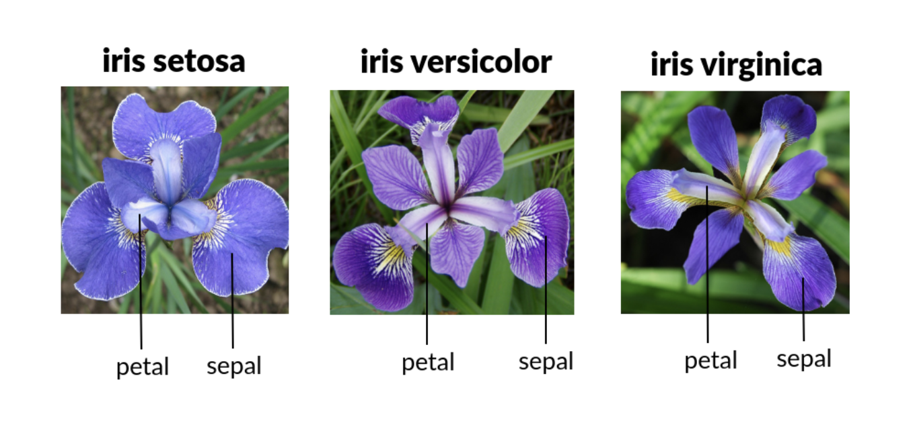

## Support Vector Machine on Iris Flower Dataset

We are going to create a model for classifying the the type of iris based on the variables of the dataset.
In first place, we’re going to identifying the variables

 

### Sepal
The sepal is the part that forms the calyx of a flower, typically function as protection for the flower in bud, and often as support for the petals when in bloom.

We have two variables

The Sepal lenght on centimeters
The Sepal Width on centimeters

### Petal

Petals are modified leaves that surround the reproductive parts of flowers.

We have two variables

The Petal lenght on centimeters
The Petal Width on centimeters